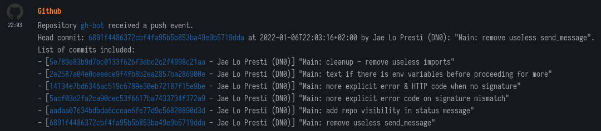
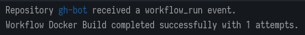

# gh-bot

gh-bot is maybe the worst (but simplest) Matrix webhook bot for Github.  

Example of commits:


Example of workflow finished:


## Setting up

### Server

You will need a secret key, generate one like this:

```bash
ruby -rsecurerandom -e 'puts SecureRandom.hex(20)'
```

A user token and a Matrix homeserver URL.

Here is an example docker-compose:

```yaml
version: '2.1'

services:
  image: ghcr.io/jaedotmoe/gh-bot:latest
  environment:
    - SEC_TOKEN=72f38e4c61b28f1c9a17868750f48330e47abd12dummy
    - MATRIX_TOKEN=syt_028ifji4jf82jf20983j03ijdummy
    - MATRIX_HOMESERVER=matrix.example.com
  ports:
    - 5000:5000
```

Now, you can invite the bot and it will auto-join room it is invited in every 15 seconds.

### Github

Go to your Github repository setting, Webhooks and Add Webhook.  
There, set these values:

 - Payload URL: Your exposed URL, for instance `https://example.com/gh/webhook`
 - Content type: `application/json`
 - Secret: your generated secret, for instance `72f38e4c61b28f1c9a17868750f48330e47abd12dummy`
 - Which events would you like to trigger this webhook: Send me everything.

And then hit Add Webhook.  
You are now good to go!

### Gitlab

Go to your repo settings, Webhooks and fill with this data:
 
 - URL: your exposed URL, for instance: `https://example.com/gh/gitlab`
 - Secret token: your generated secret, for instance `72f38e4c61b28f1c9a17868750f48330e47abd12dummy`
 - Trigger: select events you want to receive

And then click on 'Add Webhook' and there you go!

### Gitea

Go to your repo settings, Webhooks, Add Webhook, Gitea:

 - Target URL: your endpoint `https://example.com/gh/gitea`
 - POST Content Type: `application/json`
 - Secret: your secret, for instance `72f38e4c61b28f1c9a17868750f48330e47abd12dummy`
 - Trigger on: all events

Then click 'Add Webhook'.

## Support

If you need any help, [join the Matrix room](https://matrix.to/#/#home:jae.fi).
